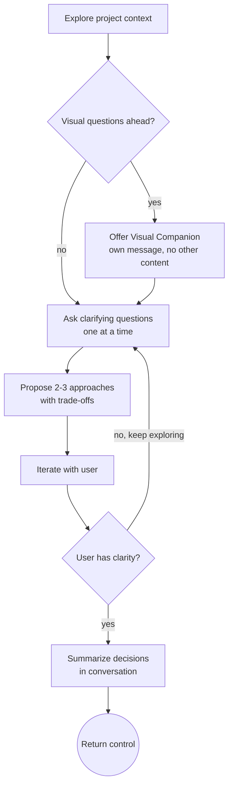

# Brainstorming — Discovery-Time Ideation

**PURPOSE**: Help the user think through ideas, compare options, and iterate on an unclear problem. Brainstorm produces *understanding*, not artifacts. Invoke it whenever you need to explore the solution space — at the start of a task, mid-implementation when scope is unclear, or any time the user says "let's think about this."

**NOT A PIPELINE STAGE**: Brainstorm is not a required step before `plan`. It hangs off `DISCOVER` as an optional tool, the same way `debug` does. The user invokes it on demand; `kickoff` may offer it during discovery if the work type benefits from exploration.

**CONFIGURATION**: Reads `jig.config.md` for `plans-directory` (only if the user opts into saving a brainstorm doc).

## When to Use

Invoke this skill when:
- Creating a new feature or component
- Adding functionality to existing code
- Modifying behavior that affects users or systems
- The user says "let's design", "how should we build", "I want to add..."
- `kickoff` offers this as a discovery-time tool during the DISCOVER stage

**Do NOT use when:**
- Fixing a bug with an obvious root cause (use `debug`)
- Running a chore or config change (skip to `plan`)
- You only need to create a PR (use `pr-create` directly)

---

## Checklist

Complete these steps in order:

1. **Explore project context** — check files, docs, recent commits
2. **Offer visual companion** (if topic involves visual questions) — its own message; see Visual Companion section
3. **Ask clarifying questions** — one at a time, understand purpose / constraints / success criteria
4. **Propose 2-3 approaches** — with trade-offs and your recommendation
5. **Iterate** — refine the approach with the user until they have clarity
6. **Hand off** — summarize what was decided in conversation; return control to the user or invoking skill. Do NOT auto-invoke `plan`. Do NOT write a design doc unless the user explicitly asks for one.

---

## Process Flow

**The terminal state is returning control.** Brainstorm produces understanding, not artifacts. Do NOT auto-invoke `plan` or any other implementation skill — the user decides what's next.

---

## The Process

### Understanding the Idea

- Check the current project state first (files, docs, recent commits)
- Before asking detailed questions, assess scope: if the request describes multiple independent subsystems (e.g., "build a platform with chat, file storage, billing, and analytics"), flag this immediately. Do not spend questions refining details of a project that needs to be decomposed first.
- If the project is too large for a single spec, help the user decompose into sub-projects: what are the independent pieces, how do they relate, what order should they be built? Then brainstorm the first sub-project through the normal design flow. Each sub-project gets its own spec, plan, and implementation cycle.
- For appropriately-scoped projects, ask questions one at a time to refine the idea
- Prefer multiple choice questions when possible, but open-ended is fine too
- **Only one question per message** -- if a topic needs more exploration, break it into multiple questions
- Focus on understanding: purpose, constraints, success criteria

### Exploring Approaches

- Propose 2-3 different approaches with trade-offs
- Present options conversationally with your recommendation and reasoning
- Lead with your recommended option and explain why
- Be specific about what each approach costs and gains

### Presenting the Design

- Once you believe you understand what to build, present the design
- Scale each section to its complexity: a few sentences if straightforward, up to 200-300 words if nuanced
- Ask after each section whether it looks right so far
- Cover: architecture, components, data flow, error handling, testing approach
- Be ready to go back and clarify if something doesn't make sense

### Design for Isolation and Clarity

- Break the system into smaller units that each have one clear purpose, communicate through well-defined interfaces, and can be understood and tested independently
- For each unit, you should be able to answer: what does it do, how do you use it, and what does it depend on?
- Can someone understand what a unit does without reading its internals? Can you change the internals without breaking consumers? If not, the boundaries need work.
- Smaller, well-bounded units are easier for AI agents to work with -- they reason better about code they can hold in context at once, and edits are more reliable when files are focused.

### Working in Existing Codebases

- Explore the current structure before proposing changes. Follow existing patterns.
- Where existing code has problems that affect the work (e.g., a file that has grown too large, unclear boundaries, tangled responsibilities), include targeted improvements as part of the design.
- Do not propose unrelated refactoring. Stay focused on what serves the current goal.

---

## After Brainstorming

Brainstorm produces no required artifact. When the user has clarity, end the session by:

1. **Summarizing the decisions** — 3-5 bullets in conversation capturing the chosen approach and key trade-offs
2. **Asking what's next** — "Want to capture this as a PRD, jump to a plan, or sit with it?"

If the user wants a design doc for archival reasons, save to `{plans-directory}/YYYY-MM-DD-<topic>-brainstorm.md` (read `plans-directory` from `jig.config.md`, default `docs/plans`). This is opt-in, not default.

**Do NOT auto-invoke `plan` or any other implementation skill.** Brainstorm's job is to leave the user better-informed; the next move is theirs.

---

## Visual Companion

A browser-based companion for showing mockups, diagrams, and visual options during brainstorming. Available as a tool -- not a mode. Accepting the companion means it is available for questions that benefit from visual treatment; it does NOT mean every question goes through the browser.

**Offering the companion:** When you anticipate that upcoming questions will involve visual content (mockups, layouts, diagrams), offer it once for consent:

> "Some of what we're working on might be easier to explain if I can show it to you in a web browser. I can put together mockups, diagrams, comparisons, and other visuals as we go. This feature is still new and can be token-intensive. Want to try it? (Requires opening a local URL)"

**This offer MUST be its own message.** Do not combine it with clarifying questions, context summaries, or any other content. Wait for the user's response before continuing. If they decline, proceed with text-only brainstorming.

**Per-question decision:** Even after the user accepts, decide FOR EACH QUESTION whether to use the browser or the terminal. The test: **would the user understand this better by seeing it than reading it?**

- **Use the browser** for content that IS visual -- mockups, wireframes, layout comparisons, architecture diagrams, side-by-side visual designs
- **Use the terminal** for content that is text -- requirements questions, conceptual choices, tradeoff lists, scope decisions

A question about a UI topic is not automatically a visual question. "What does personality mean in this context?" is a conceptual question -- use the terminal. "Which layout works better?" is a visual question -- use the browser.

---

## Key Principles

- **One question at a time** -- do not overwhelm with multiple questions
- **Multiple choice preferred** -- easier to answer than open-ended when possible
- **YAGNI ruthlessly** -- remove unnecessary features from all designs
- **Explore alternatives** -- always propose 2-3 approaches before settling
- **Incremental validation** -- present design, get approval before moving on
- **Be flexible** -- go back and clarify when something doesn't make sense

---

## Integration

**Called by:**
- Direct user invocation (`/brainstorm`)
- `kickoff` may offer it during DISCOVER for features / unclear scope

**Terminal state:**
- Return control to the user or invoking skill. No forced next step.

**Related skills:**
- `prd` — when ideas crystallize into requirements
- `plan` — when approach is clear and ready to decompose
- `debug` — sister discovery tool for understanding bugs

---

## Common Mistakes

| Mistake | Consequence | Fix |
|---------|------------|-----|
| Multiple questions per message | User overwhelmed, answers incomplete | One question at a time, always |
| Writing vague design sections | Ambiguous requirements lead to wrong implementation | Scale sections to complexity, be specific |
| Not decomposing large projects | Unmanageable scope, spec too broad | Flag multi-subsystem projects, decompose first |
| Auto-invoking `plan` after brainstorming | User loses control of the workflow | Brainstorm returns control. The user chooses what's next. |
