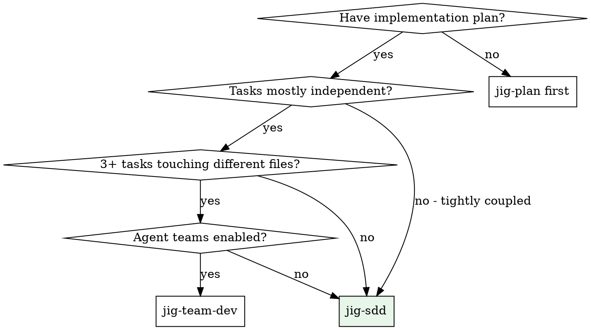
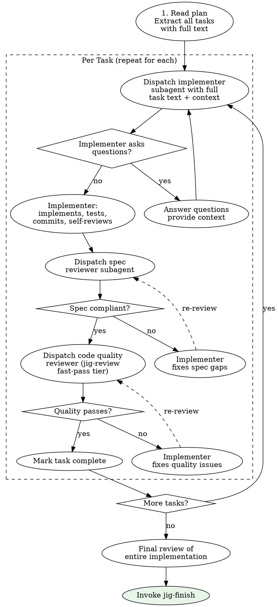

# Subagent-Driven Development

**PURPOSE**: Execute an implementation plan by dispatching a fresh subagent per task, with two-stage review after each: spec compliance first, then code quality. Fresh context per task prevents context pollution and keeps each implementer focused.

**Core principle:** Fresh subagent per task + two-stage review (spec then quality) = high quality, fast iteration.

**Why subagents:** You delegate tasks to specialized agents with isolated context. By precisely crafting their instructions and context, you ensure they stay focused and succeed at their task. They should never inherit your session's context or history -- you construct exactly what they need. This also preserves your own context for coordination work.

---

## When to Use



**Use `jig-sdd` when:**
- Tasks are tightly coupled (share files, must execute in order)
- Fewer than 3 independent tasks
- Agent teams are not available
- You prefer serial execution with review gates

**Use `jig-team-dev` instead when:**
- 3+ independent tasks touching different files
- Agent teams are enabled
- Parallel execution would significantly reduce total time

---

## The Process



### Step 1: Read and Extract

Read the plan file once. Extract ALL tasks with their full text, noting:
- Task number, title, and complete step-by-step text
- File paths per task
- Dependencies between tasks
- Context that implementers will need (architecture decisions, conventions, etc.)

### Step 2: Per-Task Execution Loop

For each task in order:

#### 2a. Dispatch Implementer Subagent

Spawn a fresh subagent with:
- The complete task text (do NOT make the subagent read the plan file)
- Relevant project context (architecture, conventions, related files)
- Reference to `jig-tdd` for TDD discipline
- Clear instructions to implement, test, and commit

**Model selection guidance:**

| Task Complexity | Signals | Recommended Model |
|----------------|---------|-------------------|
| **Mechanical** | Isolated functions, clear specs, 1-2 files, well-defined inputs/outputs | Fast/cheap model (haiku-class) |
| **Integration** | Multi-file coordination, pattern matching, debugging, API boundaries | Standard model (sonnet-class) |
| **Architecture** | Design judgment, broad codebase understanding, complex trade-offs | Most capable model (opus-class) |

Most implementation tasks are mechanical when the plan is well-specified. Default to the cheapest model that can handle the task. Escalate only when needed.

#### 2b. Handle Implementer Status

Implementer subagents report one of four statuses:

**DONE:** Proceed to spec compliance review.

**DONE_WITH_CONCERNS:** The implementer completed the work but flagged doubts. Read the concerns before proceeding. If the concerns are about correctness or scope, address them before review. If they are observations (e.g., "this file is getting large"), note them and proceed to review.

**NEEDS_CONTEXT:** The implementer needs information that was not provided. Provide the missing context and re-dispatch.

**BLOCKED:** The implementer cannot complete the task. Assess the blocker:
1. If it is a context problem, provide more context and re-dispatch with the same model
2. If the task requires more reasoning, re-dispatch with a more capable model
3. If the task is too large, break it into smaller pieces
4. If the plan itself is wrong, escalate to the user

**Never** ignore an escalation or force the same model to retry without changes. If the implementer said it is stuck, something needs to change.

#### 2c. Spec Compliance Review

After the implementer reports DONE, dispatch a spec reviewer subagent:
- Provide the original task text (the spec)
- Provide the git diff of what was implemented
- The reviewer checks: Does the implementation match the spec? Is anything missing? Is anything extra?

**If spec reviewer finds issues:**
- Send the findings back to the implementer subagent
- Implementer fixes the gaps
- Re-dispatch the spec reviewer
- Repeat until the spec reviewer approves

**Spec compliance must pass before code quality review begins.** Never reverse this order.

#### 2d. Code Quality Review

After spec compliance passes, dispatch the code quality review:
- **REQUIRED**: Use `jig-review` skill at `fast-pass` tier
- Provide the git diff (base SHA to HEAD SHA) for this task's commits
- The review swarm checks security, dead code, error handling, and other fast-pass specialists

**If quality review finds issues:**
- Send the findings back to the implementer subagent
- Implementer fixes the issues
- Re-dispatch the quality review
- Repeat until approved

#### 2e. Mark Task Complete

After both reviews pass, mark the task as complete and proceed to the next task.

### Step 3: Final Review

After all tasks are complete, dispatch a final review of the entire implementation:
- Full diff from the branch point to HEAD
- Check cross-task integration: do the pieces work together?
- Check for consistency: naming, patterns, error handling across all tasks
- This can use `jig-review` at `all` tier for the full specialist swarm

### Step 4: Finish

After the final review passes, invoke `jig-finish` to present completion options (merge, PR, keep, discard).

---

## Review Order is Non-Negotiable

```
Spec compliance FIRST -> Code quality SECOND
```

Why this order:
1. Code quality review on non-compliant code wastes time (you will rewrite it anyway)
2. Spec compliance catches scope problems (missing features, extra features)
3. Code quality catches implementation problems (bugs, style, patterns)
4. Fixing scope first, then quality, means each review pass is productive

---

## Context Management

### What to Provide the Implementer

Every implementer subagent needs:
1. **Task text** -- the complete step-by-step instructions from the plan
2. **Architecture context** -- how this task fits into the larger design
3. **File context** -- relevant existing files they will modify (read and include)
4. **Convention context** -- project conventions, patterns, naming rules
5. **Dependency context** -- what previous tasks produced that this task depends on

### What NOT to Provide

- Your full conversation history (context pollution)
- Other tasks' details (distraction)
- The entire plan file (make them read it = waste tokens)
- Previous implementer subagent interactions (irrelevant)

### The Controller's Role

You are the controller. Your job is:
1. Read the plan once, extract all tasks
2. Curate context for each implementer
3. Dispatch and monitor subagents
4. Route review findings back to implementers
5. Track progress
6. Handle escalations
7. Invoke `jig-finish` when all tasks pass

You do NOT implement tasks yourself. You coordinate.

---

## Red Flags

**Never:**
- Start implementation on main/master branch without explicit user consent
- Skip reviews (spec compliance OR code quality) for any task
- Start code quality review before spec compliance passes
- Proceed with unfixed review issues
- Dispatch multiple implementation subagents in parallel (that is `jig-team-dev`)
- Make the subagent read the plan file (provide the full text instead)
- Skip scene-setting context (subagent needs to understand where the task fits)
- Ignore subagent questions (answer before letting them proceed)
- Accept "close enough" on spec compliance (reviewer found issues = not done)
- Skip review loops (reviewer found issues -> implementer fixes -> review again)
- Let implementer self-review replace the actual review (both are needed)
- Move to next task while either review has open issues

**If subagent asks questions:**
- Answer clearly and completely
- Provide additional context if needed
- Do not rush them into implementation

**If reviewer finds issues:**
- Implementer (same subagent) fixes them
- Reviewer reviews again
- Repeat until approved
- Do not skip the re-review

**If subagent fails the task:**
- Dispatch a fix subagent with specific instructions
- Do not try to fix manually (context pollution)
- If the model is insufficient, escalate to a more capable model

---

## Example Workflow

```
Controller: I'm using Subagent-Driven Development to execute this plan.

[Read plan file: docs/plans/2026-03-28-feature-plan.md]
[Extract all 5 tasks with full text and context]

Task 1: Data model
[Dispatch implementer subagent (haiku) with task text + context]

Implementer: "Before I begin -- should the ID field be UUID or auto-increment?"
Controller: "UUID, matching existing entity patterns in src/entities/"

Implementer: "Got it. Implementing now..."
[Later]
Implementer:
  - Created entity with UUID
  - Added 4 tests, all passing
  - Self-review: clean
  - Committed: "feat(data): add Widget entity with validation"

[Dispatch spec reviewer]
Spec reviewer: PASS -- all requirements met, nothing extra

[Dispatch quality review via jig-review fast-pass]
Quality reviewer: PASS -- clean, well-structured

[Mark Task 1 complete]

Task 2: Service layer
[Dispatch implementer subagent (haiku) with task text + context from Task 1]

Implementer: [No questions, proceeds]
Implementer:
  - Implemented CRUD service
  - 6 tests passing
  - Self-review: all good
  - Committed

[Dispatch spec reviewer]
Spec reviewer: FAIL
  - Missing: pagination support (spec says "paginated list endpoint")
  - Extra: added soft-delete (not requested)

[Send findings to implementer]
Implementer: Removed soft-delete, added pagination. Committed fix.

[Re-dispatch spec reviewer]
Spec reviewer: PASS

[Dispatch quality review]
Quality reviewer: Minor -- magic number for page size. Extract constant.

[Send finding to implementer]
Implementer: Extracted PAGE_SIZE constant. Committed.

[Re-dispatch quality review]
Quality reviewer: PASS

[Mark Task 2 complete]

... (Tasks 3-5) ...

[All tasks complete]
[Dispatch final review of full implementation]
Final reviewer: All requirements met, cross-task integration clean.

[Invoke jig-finish]
```

---

## Integration

**Called by:**
- `jig-plan` (execution handoff) -- when user chooses sequential execution
- `jig-kickoff` during the EXECUTE stage

**Terminal state:**
- **REQUIRED**: Invoke `jig-finish` after all tasks pass final review

**Implementer subagents use:**
- `jig-tdd` -- TDD discipline for each task

**Review uses:**
- `jig-review` -- swarm review at fast-pass tier per task, all tier for final review

**Related skills:**
- `jig-plan` -- creates the plan this skill executes
- `jig-team-dev` -- parallel alternative for 3+ independent tasks
- `jig-verify` -- verification discipline before claiming task completion
- `jig-finish` -- handles branch completion after all tasks pass

**Alternative:**
- `jig-team-dev` -- use for parallel execution when tasks are independent and agent teams are enabled

---

## Advantages Over Manual Execution

| Aspect | Manual | Subagent-Driven |
|--------|--------|-----------------|
| Context management | Accumulates, degrades | Fresh per task |
| Review discipline | Easy to skip | Enforced two-stage gate |
| Consistency | Varies with fatigue | Uniform quality |
| Progress tracking | Ad-hoc | Systematic task completion |
| Error isolation | Hard to pinpoint | Per-task review catches issues early |
| Cost vs. Quality | Low cost, variable quality | Higher cost, consistent quality |
