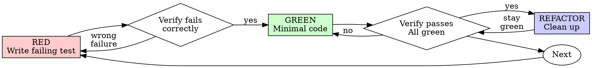

# Test-Driven Development (TDD)

**PURPOSE**: Write the test first. Watch it fail. Write minimal code to pass. This ensures every line of production code is justified by a test that proves it works and catches regressions.

**Core principle:** If you did not watch the test fail, you do not know if it tests the right thing.

**Violating the letter of the rules is violating the spirit of the rules.**

---

## The Iron Law

```
NO PRODUCTION CODE WITHOUT A FAILING TEST FIRST
```

Write code before the test? Delete it. Start over.

**No exceptions:**
- Do not keep it as "reference"
- Do not "adapt" it while writing tests
- Do not look at it
- Delete means delete

Implement fresh from tests. Period.

---

## When to Use

**Always:**
- New features
- Bug fixes
- Refactoring
- Behavior changes

**Exceptions (ask the user):**
- Throwaway prototypes
- Generated code
- Configuration files with no logic

Thinking "skip TDD just this once"? Stop. That is rationalization.

---

## Red-Green-Refactor



### RED -- Write Failing Test

Write one minimal test showing what should happen.

**Good test:**
```
test "retries failed operations 3 times":
  attempts = 0
  operation = function that:
    increments attempts
    throws error if attempts < 3
    returns "success" otherwise

  result = retry_operation(operation)

  assert result == "success"
  assert attempts == 3
```
Clear name, tests real behavior, one thing.

**Bad test:**
```
test "retry works":
  mock = create_mock()
    .fails_twice()
    .then_succeeds("success")

  retry_operation(mock)

  assert mock.call_count == 3
```
Vague name, tests mock not code.

**Requirements:**
- One behavior per test
- Clear, descriptive name
- Real code (no mocks unless unavoidable)
- Asserts the outcome, not the implementation

### Verify RED -- Watch It Fail

**MANDATORY. Never skip.**

Run the test command for your project:
```
<test-runner> <path-to-test-file>
```

Confirm:
- Test fails (not errors from syntax/import problems)
- Failure message is the expected one (e.g., "function not defined", "expected X got Y")
- Fails because the feature is missing (not because of typos or setup bugs)

**Test passes immediately?** You are testing existing behavior, not new behavior. Fix the test.

**Test errors instead of failing?** Fix the error (import, syntax, setup), re-run until it fails correctly.

### GREEN -- Minimal Code

Write the simplest code that makes the test pass.

**Good:**
```
function retry_operation(fn):
  for i in range(3):
    try:
      return fn()
    catch error:
      if i == 2: raise error
```
Just enough to pass.

**Bad:**
```
function retry_operation(fn, options={}):
  max_retries = options.max_retries or 3
  backoff = options.backoff or "linear"
  on_retry = options.on_retry or noop
  // YAGNI -- no test asked for this
```
Over-engineered. Do not add features, refactor other code, or "improve" beyond the test.

### Verify GREEN -- Watch It Pass

**MANDATORY.**

Run the test command:
```
<test-runner> <path-to-test-file>
```

Confirm:
- New test passes
- All other tests still pass
- Output is clean (no errors, warnings, deprecation notices)

**New test fails?** Fix the code, not the test.

**Other tests broke?** Fix them now, before moving on.

### REFACTOR -- Clean Up

After green only:
- Remove duplication
- Improve names
- Extract helpers
- Simplify logic

Keep tests green throughout refactoring. Do not add behavior during refactoring.

### Repeat

Next failing test for the next behavior.

---

## Good Test Qualities

| Quality | Good | Bad |
|---------|------|-----|
| **Minimal** | Tests one thing. "and" in the name? Split it. | `test "validates email and domain and whitespace"` |
| **Clear** | Name describes the behavior being tested | `test "test1"`, `test "it works"` |
| **Shows intent** | Demonstrates the desired API and behavior | Obscures what the code should do |
| **Independent** | Does not depend on other tests running first | Relies on shared state from previous test |
| **Deterministic** | Same result every time | Flaky due to timing, randomness, or external state |
| **Fast** | Runs in milliseconds | Needs network, database, or filesystem |

---

## Why Order Matters

**"I'll write tests after to verify it works"**

Tests written after code pass immediately. Passing immediately proves nothing:
- Might test the wrong thing
- Might test implementation, not behavior
- Might miss edge cases you forgot
- You never saw it catch the bug

Test-first forces you to see the test fail, proving it actually tests something.

**"I already manually tested all the edge cases"**

Manual testing is ad-hoc. You think you tested everything but:
- No record of what you tested
- Cannot re-run when code changes
- Easy to forget cases under pressure
- "It worked when I tried it" does not equal comprehensive

Automated tests are systematic. They run the same way every time.

**"Deleting X hours of work is wasteful"**

Sunk cost fallacy. The time is already gone. Your choice now:
- Delete and rewrite with TDD (X more hours, high confidence)
- Keep it and add tests after (30 min, low confidence, likely bugs)

The "waste" is keeping code you cannot trust. Working code without real tests is technical debt.

**"TDD is dogmatic, being pragmatic means adapting"**

TDD IS pragmatic:
- Finds bugs before commit (faster than debugging after)
- Prevents regressions (tests catch breaks immediately)
- Documents behavior (tests show how to use the code)
- Enables refactoring (change freely, tests catch breaks)

"Pragmatic" shortcuts = debugging in production = slower.

**"Tests after achieve the same goals -- it's spirit not ritual"**

No. Tests-after answer "What does this do?" Tests-first answer "What should this do?"

Tests-after are biased by your implementation. You test what you built, not what is required. You verify remembered edge cases, not discovered ones.

Tests-first force edge case discovery before implementing. Tests-after verify you remembered everything (you did not).

---

## The Delete Rule

**If you wrote production code before writing a test:**

1. Delete the production code
2. Write the failing test
3. Implement fresh from the test
4. Do NOT keep the deleted code as "reference"
5. Do NOT "adapt" the deleted code
6. Do NOT look at the deleted code

**Why this is absolute:**
- Code written without test discipline has different shape than TDD code
- "Adapting" means you are testing implementation, not behavior
- "Reference" means you will copy-paste, not rethink
- The 5 minutes you save by adapting costs hours in bugs later

---

## Common Rationalizations

| Excuse | Reality |
|--------|---------|
| "Too simple to test" | Simple code breaks. Test takes 30 seconds. |
| "I'll test after" | Tests passing immediately prove nothing. |
| "Tests after achieve same goals" | Tests-after = "what does this do?" Tests-first = "what should this do?" |
| "Already manually tested" | Ad-hoc is not systematic. No record, cannot re-run. |
| "Deleting X hours is wasteful" | Sunk cost fallacy. Keeping unverified code is technical debt. |
| "Keep as reference, write tests first" | You will adapt it. That is testing after. Delete means delete. |
| "Need to explore first" | Fine. Throw away exploration, start with TDD. |
| "Test is hard = skip it" | Hard to test = hard to use. Listen to the test. Simplify the design. |
| "TDD will slow me down" | TDD is faster than debugging. Pragmatic = test-first. |
| "Manual test is faster" | Manual does not prove edge cases. You will re-test every change. |
| "Existing code has no tests" | You are improving it. Add tests for the code you touch. |
| "This is different because..." | It is not. |

---

## Red Flags -- STOP and Start Over

If any of these happen, delete the production code and start with a test:

- Code written before test
- Test written after implementation
- Test passes immediately (never saw it fail)
- Cannot explain why the test failed
- Tests added "later"
- Rationalizing "just this once"
- "I already manually tested it"
- "Tests after achieve the same purpose"
- "It's about spirit not ritual"
- "Keep as reference" or "adapt existing code"
- "Already spent X hours, deleting is wasteful"
- "TDD is dogmatic, I'm being pragmatic"
- "This is different because..."

**All of these mean: Delete code. Start over with TDD.**

---

## Verification Checklist

Before marking work complete:

- [ ] Every new function/method has a test
- [ ] Watched each test fail before implementing
- [ ] Each test failed for the expected reason (feature missing, not typo)
- [ ] Wrote minimal code to pass each test
- [ ] All tests pass
- [ ] Output is clean (no errors, warnings)
- [ ] Tests use real code (mocks only if unavoidable)
- [ ] Edge cases and error paths covered

Cannot check all boxes? You skipped TDD. Start over.

---

## When Stuck

| Problem | Solution |
|---------|----------|
| Do not know how to test | Write the wished-for API. Write the assertion first. Ask the user. |
| Test too complicated | Design too complicated. Simplify the interface. |
| Must mock everything | Code too coupled. Use dependency injection. |
| Test setup is huge | Extract helpers. Still complex? Simplify design. |
| No test framework | Use the simplest assertion mechanism available. Even `assert` statements work. |

---

## Debugging Integration

Bug found? Write a failing test that reproduces it. Follow the TDD cycle. The test proves the fix works and prevents regression.

Never fix bugs without a test.

**REQUIRED**: Use `jig-debug` for systematic root cause investigation before writing the failing test. The test should target the root cause, not the symptom.

---

## Integration

**Called by:**
- `jig-plan` -- references TDD for implementers
- `jig-sdd` -- subagents follow TDD per task
- `jig-team-dev` -- implementer teammates follow TDD per task
- `jig-debug` -- Phase 4 uses TDD for the failing test case

**Related skills:**
- `jig-debug` -- for root cause investigation before writing the regression test
- `jig-verify` -- for verifying that tests actually pass before claiming completion

---

## Final Rule

```
Production code -> test exists and failed first
Otherwise -> not TDD
```

No exceptions without the user's explicit permission.
