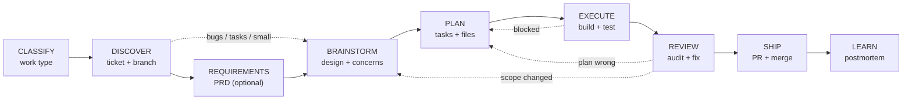
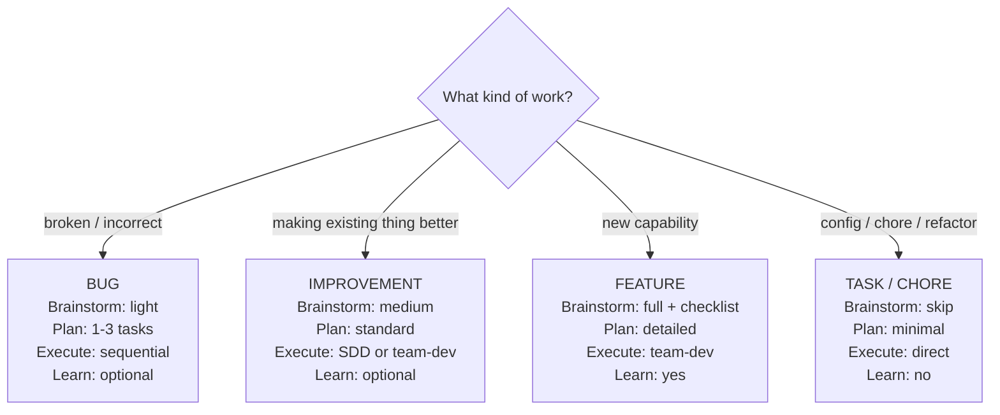

# Jig Development Pipeline

**PURPOSE**: The pipeline orchestrator. Routes work through stages and checks gates at each transition. **Kickoff does NOT execute stages itself** — it invokes the downstream skill for each stage using the Skill tool.

**ORCHESTRATOR RULE**: At every stage transition, you MUST invoke the downstream skill using the Skill tool (e.g., `Skill: jig:brainstorm`). Do NOT attempt to execute the stage inline by following kickoff's summary of what the stage does. The downstream skill has the full process — kickoff only knows enough to route and check gates.

**CONFIGURATION**: Reads `jig.config.md` for pipeline stages, work type overrides, ticket system, branching format, and concerns checklist.

---

## When to Use

Invoke this skill when:
- Starting development work of any kind
- "I need to add/fix/build/improve..."
- "Let's work on [ticket]"
- "There's a bug in..."
- Beginning a new session with a development task
- You want the full pipeline, not just one stage

**Do NOT use when** you only need a single stage (e.g., just creating a PR → use `pr-create` directly).

---

## Terminology

| Term | Meaning |
|------|---------|
| **SDD** | Subagent-Driven Development (`sdd`) — sequential execution, one task at a time |
| **Team-dev** | `team-dev` — parallel execution with agent teams in split panes + two-stage quality gates |

## The Pipeline



Each stage has a **gate**. You don't move forward until the gate is satisfied.

The pipeline stages and work type overrides are configurable in `jig.config.md`. Read the config at the start of each session to determine which stages to run.

---

## Step 1: Classify the Work

Before anything else, determine the work type. This controls pipeline depth.



Check `jig.config.md` for stage overrides per work type. The config may skip or lighten stages beyond these defaults.

Ask the user if the type isn't obvious from context.

---

## Step 2: DISCOVER

**Gate**: A ticket exists and the problem is understood.

### Actions

1. **Check for existing ticket**:
   - Branch name contains a ticket reference? Look it up.
   - User mentioned a ticket? Fetch it.
   - No ticket? Create one. Check `jig.config.md` for `ticket-system` (Linear, Jira, GitHub Issues) and use the appropriate tool.

2. **Understand the problem**:
   - Read the ticket description and acceptance criteria.
   - For bugs: check error tracking, reproduce if possible.
   - For features: confirm scope with the user if ambiguous.

3. **Set up the branch**:
   Read branching format from `jig.config.md`:
   ```bash
   git checkout -b {format from config}
   ```

### Gate Check

Before proceeding, confirm:
- [ ] Ticket exists with clear acceptance criteria
- [ ] Branch follows the team's naming convention
- [ ] Problem is understood (not just the title — the actual problem)

---

## Step 2b: REQUIREMENTS (optional)

**Gate**: PRD exists or user opted to skip.

For **features** and **large improvements**, prompt: "Want to capture requirements first with `/prd`?"

If yes: **INVOKE `jig:prd` using the Skill tool.** Do not write the PRD inline — the `prd` skill has the full process (tier selection, 12-section structure, acceptance checklist format). Wait for it to complete before proceeding.

For **bugs**, **tasks**, and **small improvements**: skip this step. Users can still invoke `/prd` manually if needed.

### Gate Check

- [ ] PRD saved to `docs/plans/YYYY-MM-DD-<topic>-prd.md` OR user opted to skip
- [ ] If PRD exists, acceptance checklist has `[ ]` items tagged by layer

---

## Step 3: BRAINSTORM

**Gate**: A design is approved by the user.

**Routing by work type:**

| Work Type | Brainstorm Depth | Action |
|-----------|-----------------|--------|
| Bug | Light | Invoke `jig:brainstorm` — focuses on root cause and fix approach |
| Improvement | Medium | Invoke `jig:brainstorm` — explores approaches with concerns checklist |
| Feature | Full | Invoke `jig:brainstorm` — full design exploration with concerns checklist |
| Task/Chore | Skip | Move directly to Step 4: PLAN |

**INVOKE `jig:brainstorm` using the Skill tool.** Do not brainstorm inline — the `brainstorm` skill has the full interview process, approach generation, concerns checklist integration, and design approval flow. Kickoff's job is to tell the skill what depth to use (light/medium/full) based on the work type classification from Step 1.

Pass the work type context when invoking: "This is a {work type}. Run {depth} brainstorming."

### Gate Check

Before proceeding, confirm:
- [ ] Design is reviewed and approved by the user
- [ ] Concerns checklist completed (features/improvements)
- [ ] Design doc saved to `docs/plans/YYYY-MM-DD-<topic>-design.md` (features)

---

## Step 4: PLAN

**Gate**: A numbered plan exists with tasks, files, and verification steps.

**INVOKE `jig:plan` using the Skill tool.** Do not write the plan inline — the `plan` skill handles task decomposition, file path identification, dependency mapping, verification steps, and TDD orientation. It saves the plan to `docs/plans/`.

If a PRD was created in Step 2b, mention it when invoking: "PRD is at docs/plans/YYYY-MM-DD-<topic>-prd.md."

### Gate Check

Before proceeding, confirm:
- [ ] Plan reviewed and approved by the user
- [ ] Tasks have clear file paths and skill references
- [ ] Dependencies identified (which tasks block which)
- [ ] Plan saved to `docs/plans/`

---

## Step 5: EXECUTE

**Gate**: All tasks implemented, tested, and committed.

**INVOKE `jig:build` using the Skill tool.** Pass the plan path: "Execute the plan at docs/plans/YYYY-MM-DD-<topic>-plan.md." The `build` skill analyzes the task graph and auto-selects parallel (`team-dev`) or serial (`sdd`) execution. Do not choose the strategy yourself.

### Gate Check

Before proceeding, confirm:
- [ ] All tasks from the plan are implemented
- [ ] Tests pass (as specified in plan)
- [ ] Changes committed with proper messages
- [ ] Project builds successfully

---

## Step 6: REVIEW

**Gate**: Code passes self-audit and automated review.

**INVOKE `jig:review` using the Skill tool.** The `review` skill dispatches the specialist swarm (security, dead code, error handling, async safety, performance + team specialists), scores findings, and produces a unified report. Fix any Critical or Major issues before proceeding.

### Gate Check

Before proceeding, confirm:
- [ ] Self-audit checklist passed
- [ ] No Critical issues in review report
- [ ] All Major issues addressed or acknowledged

---

## Step 7: SHIP

**Gate**: PR created and merged.

1. **Commit**: Invoke the `jig:commit` agent (Agent tool with `subagent_type: "jig:commit"`)
2. **Create PR**: **INVOKE `jig:pr-create` using the Skill tool.** It runs the review swarm, analyzes commits, and creates the PR.
3. **Address feedback**: **INVOKE `jig:pr-respond` using the Skill tool** for any reviewer comments.
4. **Merge**: After approval

### Gate Check

- [ ] PR created with clear description
- [ ] Ticket referenced (per `jig.config.md` settings)
- [ ] CI passes
- [ ] Reviewer approval received

---

## Step 8: LEARN (features only, optional for others)

**INVOKE `jig:postmortem` using the Skill tool.** It analyzes reviewer comments for patterns, identifies gaps in skills, and updates skills or configs. This closes the feedback loop.

---

## Stage Transitions

The pipeline enforces ordering. Here's the complete transition map:

```
CLASSIFY
  └──> DISCOVER (always)
         ├──> REQUIREMENTS (features, large improvements — optional)
         │    └──> BRAINSTORM
         │
         ├──> BRAINSTORM (bugs, small improvements — skip requirements)
         │    └──> PLAN (always after brainstorm)
         │
         └──> PLAN (tasks/chores skip brainstorm + requirements)
                └──> EXECUTE (always)
                       └──> REVIEW (always)
                              └──> SHIP (always)
                                     └──> LEARN (features, complex improvements)
```

### Looping Back

The pipeline isn't strictly linear. You may loop back when:

- **Plan is wrong** → Return to Plan, revise tasks
- **Scope changed during execution** → Return to Brainstorm, update design
- **Review finds design issues** → Return to Plan or Brainstorm depending on severity
- **PR feedback requires significant changes** → Return to Execute

When looping back, update the plan document to reflect changes.

---

## Common Mistakes

| Mistake | Consequence | Fix |
|---------|------------|-----|
| Skipping Discover | No ticket, no branch convention, no tracking | Always start with the ticket |
| Skipping Requirements for features | Vague scope, acceptance criteria discovered mid-implementation | Run `/prd` before brainstorming |
| Skipping Brainstorm | Missing cross-cutting concerns | Run the Concerns Checklist |
| Skipping Plan for "simple" features | Can't parallelize, ad-hoc execution | Even 2-task plans help |
| Skipping Review | AI-generated bugs ship to production | Self-audit is non-negotiable |
| Skipping Learn | Same review feedback on every PR | Run postmortem on complex features |
| Starting with code | "Add a button" without understanding the requirement | Discover first, always |
| Planning without brainstorming | Plan misses cross-cutting concerns | Design before decomposing |

---

## Quick Reference

| Stage | Skill Tool Invocation | Output |
|-------|----------------------|--------|
| Classify | (kickoff handles directly) | Work type determined |
| Discover | (kickoff handles directly) | Ticket + branch |
| Requirements | `Skill: jig:prd` | PRD with acceptance checklist |
| Brainstorm | `Skill: jig:brainstorm` | Approved design |
| Plan | `Skill: jig:plan` | `docs/plans/*.md` |
| Execute | `Skill: jig:build` | Implemented + tested code |
| Review | `Skill: jig:review` | Audited code |
| Ship | `Skill: jig:pr-create` | Merged PR |
| Learn | `Skill: jig:postmortem` | Updated skills |
