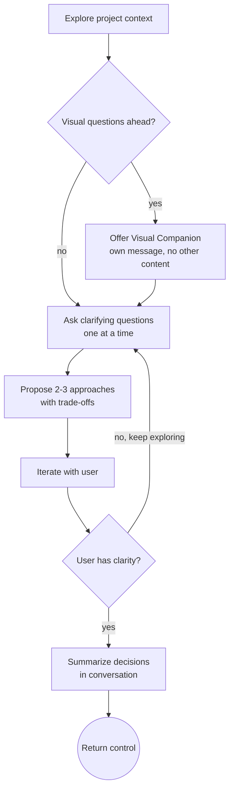
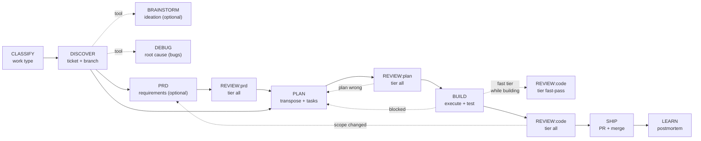
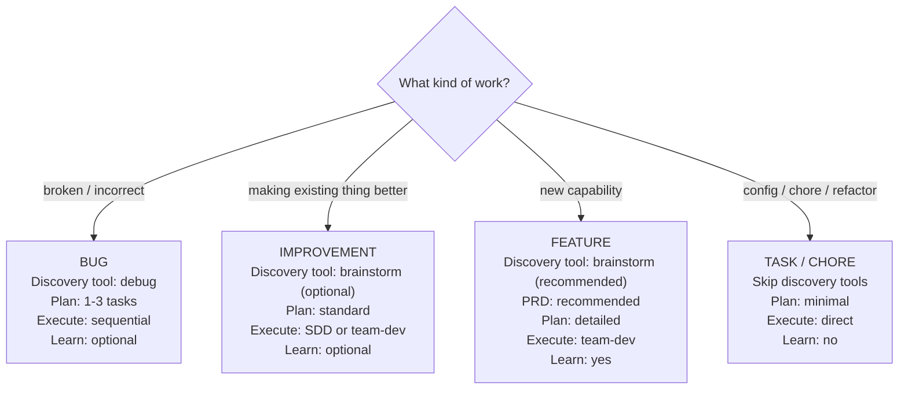

# Pipeline Refactor — Brainstorm Decoupling, TRANSPOSE, Configurable Storage

> **For agents:** Use team-dev (parallel) or sdd (sequential) to implement this plan task-by-task. Steps use checkbox (`- [ ]`) syntax for tracking.

**Goal:** Reshape the Jig pipeline so brainstorm is a discovery-time tool (not a forced pre-plan stage), introduce an explicit TRANSPOSE phase inside `plan` that distills PRD/context into a build sequence, surface `review` as a multi-stage gate, and make PRD/plan storage configurable with an optional remote-sync hook.

**Architecture:** Refactor in dependency order: config schema first, then the skills it affects, then the framework docs and cross-references. Brainstorm sheds its design-doc and concerns-checklist duties; PRD absorbs the concerns checklist; plan grows an explicit "Step 1: Distill the Source" phase that branches on PRD presence; kickoff's diagram and transition map are rewritten to reflect the new flow. Linear-doc sync is scoped as a pack-level adapter behind a generic `prd-sync` config key.

**Tech Stack:** Markdown skills, YAML frontmatter, Mermaid diagrams. No code changes — this is a framework reshape.

---

## File Structure

| File | Action | Responsibility |
|------|--------|---------------|
| `jig.config.md` | Modify | Remove `brainstorm` from stages; add `## Documents` section; update work-type overrides |
| `scaffold/jig.config.md` | Modify | Mirror new schema for `jig init` |
| `core/skills/brainstorm/SKILL.md` | Modify | Pure ideation; remove design-doc output, concerns checklist, forced `plan` terminal |
| `core/skills/prd/SKILL.md` | Modify | Absorb concerns checklist; read `plans-directory` and `prd-sync` from config |
| `core/skills/plan/SKILL.md` | Modify | Add Step 1 TRANSPOSE; remove "use brainstorm first" gate; read `plans-directory` from config |
| `core/skills/kickoff/SKILL.md` | Modify | New Mermaid diagram; brainstorm/debug as discovery tools; review shown at three stages; transition map rewritten |
| `framework/PIPELINE.md` | Modify | Reflect 6-stage pipeline; describe review as multi-stage gate engine |
| `framework/CONCERNS_CHECKLIST.md` | Modify | Move home from brainstorm to prd; update work-type behavior |
| `framework/DISCOVERY.md` | Modify | Update brainstorm reference in checklist section |
| `framework/TIER_SYSTEM.md` | Modify | Update brainstorm example wording |
| `core/skills/build/SKILL.md` | Modify | Drop "after brainstorm → plan" wording; reference plan directly |
| `core/skills/debug/SKILL.md` | Modify | Update kickoff-route wording (no "light brainstorm then here") |
| `core/skills/team-dev/SKILL.md` | Modify | Update "Have plan? No → brainstorm + plan first" branch |
| `core/skills/init/SKILL.md` | Modify | Update concerns-checklist wording (surfaces during PRD, not brainstorm) |
| `core/skills/extend/SKILL.md` | Modify | Update concerns-checklist wording; flow refers to PRD |
| `scaffold/team/README.md` | Modify | Update concerns-checklist wording if it appears |
| `packs/linear/README.md` | Modify | Add "PRD document sync" section behind `prd-sync: linear` |
| `packs/linear/pack.json` | Modify | Note doc-sync capability (no skill files yet — README-driven) |
| `CLAUDE.md` | Modify | Update pipeline reference if it appears |

---

## Task 1: Update `jig.config.md` schema

**Files:**
- Modify: `jig.config.md`

**Dependencies:** None — this is the foundation other tasks depend on.

- [ ] **Step 1: Remove `brainstorm` from the `stages:` list**

In the `## Pipeline` section, change:

```yaml
stages:
  - discover
  - brainstorm
  - plan
  - execute
  - review
  - ship
  - learn
```

to:

```yaml
stages:
  - discover
  - plan
  - execute
  - review
  - ship
  - learn
```

- [ ] **Step 2: Update work-type overrides**

Replace the `### Stage Overrides by Work Type` block with:

```yaml
bug:
  skip: [learn]
  review: light
task:
  skip: [learn]
  review: light
```

The `brainstorm: light` and `skip: [brainstorm, ...]` keys are removed since brainstorm is no longer a pipeline stage.

- [ ] **Step 3: Add `## Documents` section**

Insert this section after `## Branching` and before `## Concerns Checklist`:

```yaml
## Documents

```yaml
plans-directory: docs/plans
filename-format: "{date}-{topic}-{kind}.md"  # kind = prd | plan
# prd-sync: none            # none | linear | jira | github (pack-driven)
# plan-sync: none
```
```

- [ ] **Step 4: Verify the file parses and reads correctly**

Run:
```bash
grep -A 8 "## Pipeline" jig.config.md
grep -A 6 "## Documents" jig.config.md
grep "brainstorm" jig.config.md
```

Expected: stages list has 6 entries (no brainstorm), Documents section present, no `brainstorm` matches in the file.

- [ ] **Step 5: Commit**

```bash
git add jig.config.md
git commit -m "chore(config): remove brainstorm stage, add Documents section"
```

---

## Task 2: Reshape `core/skills/brainstorm/SKILL.md` to pure discovery

**Files:**
- Modify: `core/skills/brainstorm/SKILL.md`

**Dependencies:** Task 1 (config schema must be updated first so brainstorm doesn't reference an old stage list)

- [ ] **Step 1: Update the frontmatter description**

Replace the description with:

```yaml
description: >
  Use when exploring ideas, comparing approaches, or refining an unclear
  problem — at any point in the workflow. A discovery-time tool, not a
  pipeline stage. Invokable directly via /brainstorm or offered by kickoff
  during DISCOVER. Produces understanding, not artifacts.
```

- [ ] **Step 2: Rewrite the purpose statement**

Replace lines 12-18 (the `# Brainstorming Ideas Into Designs` heading and PURPOSE/CONFIGURATION block) with:

```markdown
# Brainstorming — Discovery-Time Ideation

**PURPOSE**: Help the user think through ideas, compare options, and iterate on an unclear problem. Brainstorm produces *understanding*, not artifacts. Invoke it whenever you need to explore the solution space — at the start of a task, mid-implementation when scope is unclear, or any time the user says "let's think about this."

**NOT A PIPELINE STAGE**: Brainstorm is not a required step before `plan`. It hangs off `DISCOVER` as an optional tool, the same way `debug` does. The user invokes it on demand; `kickoff` may offer it during discovery if the work type benefits from exploration.
```

- [ ] **Step 3: Remove the HARD-GATE block and "Anti-Pattern: Too Simple" section**

Delete lines 36-46 (the `<HARD-GATE>` block and the "Anti-Pattern" section). Brainstorm is no longer gating implementation — `plan` and `build` handle their own gates.

- [ ] **Step 4: Update the Checklist section**

Replace the Checklist (lines 49-63) with:

```markdown
## Checklist

Complete these steps in order:

1. **Explore project context** — check files, docs, recent commits
2. **Offer visual companion** (if topic involves visual questions) — its own message; see Visual Companion section
3. **Ask clarifying questions** — one at a time, understand purpose / constraints / success criteria
4. **Propose 2-3 approaches** — with trade-offs and your recommendation
5. **Iterate** — refine the approach with the user until they have clarity
6. **Hand off** — summarize what was decided in conversation; return control to the user or invoking skill. Do NOT auto-invoke `plan`. Do NOT write a design doc unless the user explicitly asks for one.
```

- [ ] **Step 5: Remove the Concerns Checklist section entirely**

Delete the `## Concerns Checklist (Configurable)` section (lines 132-149). It now lives in `prd`. Brainstorm callers who need a structured concerns walk-through should invoke `/prd` instead.

- [ ] **Step 6: Remove the "After the Design" section's design-doc and plan-handoff content**

Replace the `## After the Design` section (lines 154-191) with:

```markdown
## After Brainstorming

Brainstorm produces no required artifact. When the user has clarity, end the session by:

1. **Summarizing the decisions** — 3-5 bullets in conversation capturing the chosen approach and key trade-offs
2. **Asking what's next** — "Want to capture this as a PRD, jump to a plan, or sit with it?"

If the user wants a design doc for archival reasons, save to `{plans-directory}/YYYY-MM-DD-<topic>-brainstorm.md` (read `plans-directory` from `jig.config.md`, default `docs/plans`). This is opt-in, not default.

**Do NOT auto-invoke `plan` or any other implementation skill.** Brainstorm's job is to leave the user better-informed; the next move is theirs.
```

- [ ] **Step 7: Update the Process Flow Mermaid diagram**

Replace the diagram in `## Process Flow` (lines 68-84) with:



- [ ] **Step 8: Update the Integration section**

Replace the Integration section (lines 226-235) with:

```markdown
## Integration

**Called by:**
- Direct user invocation (`/brainstorm`)
- `kickoff` may offer it during DISCOVER for features / unclear scope

**Terminal state:**
- Return control to the user or invoking skill. No forced next step.

**Related skills:**
- `prd` — when ideas crystallize into requirements
- `plan` — when approach is clear and ready to decompose
- `debug` — sister discovery tool for understanding bugs
```

- [ ] **Step 9: Update Common Mistakes table**

Remove the "Skipping Concerns Checklist" row (no longer applies). Remove "Jumping to implementation before approval" row (no longer a gate). Add:

| Auto-invoking `plan` after brainstorming | User loses control of the workflow | Brainstorm returns control. The user chooses what's next. |

- [ ] **Step 10: Update the Configuration line**

Replace the `**CONFIGURATION**:` line near the top with:

```markdown
**CONFIGURATION**: Reads `jig.config.md` for `plans-directory` (only if the user opts into saving a brainstorm doc).
```

- [ ] **Step 11: Verify the rewrite**

Run:
```bash
wc -l core/skills/brainstorm/SKILL.md
grep -n "HARD-GATE\|Concerns Checklist\|REQUIRED.*plan" core/skills/brainstorm/SKILL.md
grep -n "discovery" core/skills/brainstorm/SKILL.md
```

Expected: line count noticeably smaller than before (was 250); HARD-GATE / Concerns Checklist / REQUIRED-plan strings gone; "discovery" appears in purpose/description.

- [ ] **Step 12: Commit**

```bash
git add core/skills/brainstorm/SKILL.md
git commit -m "refactor(core): brainstorm becomes pure discovery, no forced terminal"
```

---

## Task 3: PRD absorbs the Concerns Checklist + reads storage config

**Files:**
- Modify: `core/skills/prd/SKILL.md`

**Dependencies:** Task 1 (config schema), Task 2 (brainstorm no longer owns checklist)

- [ ] **Step 1: Update CONFIGURATION line**

Replace the `**CONFIGURATION**:` line near the top with:

```markdown
**CONFIGURATION**: Reads `jig.config.md` for `ticket-system` (sync target), `plans-directory` (local save location), `prd-sync` (optional remote document sync), and the `## Concerns Checklist` (concerns to walk through).
```

- [ ] **Step 2: Add a new Step 3c: Concerns Walk-Through**

Insert this section between Step 3b (PRD Review Swarm) and Step 4 (Refine):

```markdown
### Step 3c: Concerns Walk-Through

After the swarm findings are presented but before refinement, walk through the `## Concerns Checklist` from `jig.config.md`.

For each concern listed:
- If marked **Yes** and mapped to a skill -> load that skill for guidance, then capture its implications as new acceptance items
- If marked **Yes** and mapped to a specialist -> note the specialist's domain; the specialist will validate during `review:prd`
- If marked **Yes** and mapped to `manual` -> add an acceptance item flagging human review
- If marked **No** or **N/A** -> record the decision with brief rationale in an "Open Questions" or "Out of Scope" section

Each `Yes` concern adds scope to the PRD acceptance checklist. The user must explicitly approve added scope.

**Work type behavior:**
- Features and large improvements: full walk-through
- Bugs and small improvements: only walk through concerns flagged relevant by the swarm or user
- Tasks: skip

**If no concerns checklist is configured in `jig.config.md`**, use minimal defaults: error-handling, security, test-strategy.

See `framework/CONCERNS_CHECKLIST.md` for full configuration documentation.
```

- [ ] **Step 3: Update Step 5 (Save) to use configurable paths**

Replace the Save section with:

```markdown
### Step 5: Save

1. **Determine the local save path** — read `plans-directory` and `filename-format` from `jig.config.md` (defaults: `docs/plans/` and `{date}-{topic}-{kind}.md`). Resolve to e.g. `docs/plans/2026-05-27-export-feature-prd.md`.
2. **Write the PRD** to the resolved path.
3. **Check `prd-sync` in `jig.config.md`** — if set (e.g., `prd-sync: linear`), invoke the configured pack's doc-sync instructions. See the pack's README for the sync method (e.g., `packs/linear/README.md` → "PRD document sync").
4. **Always offer ticket sync** — "Want to also sync these requirements to the ticket description?" If yes, push the PRD content to the ticket system configured in `jig.config.md` (separate from doc sync — ticket is the issue, doc is the standalone artifact).
5. **Confirm all save locations** to the user.
```

- [ ] **Step 4: Update the "Integration with kickoff" section**

Replace the section (lines 367-380) with:

```markdown
## Integration with kickoff

This skill sits inside the **DISCOVER** stage in the kickoff pipeline as an optional requirements-capture tool:

```
CLASSIFY -> DISCOVER -> (PRD optional) -> PLAN -> EXECUTE -> REVIEW -> SHIP -> LEARN
```

- **Features**: kickoff prompts "Capture requirements with `/prd`?"
- **Large improvements**: prompted
- **Bugs/tasks**: skipped (invoke manually if needed)

The PRD becomes the **input** to `plan`'s TRANSPOSE step. `plan` reads the PRD's acceptance checklist and distills it into a build sequence. The PRD defines *what* the requirements are; `plan` decides *how* to satisfy them.
```

- [ ] **Step 5: Update Quick Reference**

Replace the "Save location" row with:

```markdown
| Save location | `{plans-directory}/{filename-format}` (default: `docs/plans/YYYY-MM-DD-<topic>-prd.md`) |
| Remote sync | Optional via `prd-sync` in `jig.config.md` (pack-driven) |
```

- [ ] **Step 6: Verify**

Run:
```bash
grep -n "Concerns Walk-Through\|plans-directory\|prd-sync" core/skills/prd/SKILL.md
```

Expected: all three strings present; concerns walk-through is a new step.

- [ ] **Step 7: Commit**

```bash
git add core/skills/prd/SKILL.md
git commit -m "refactor(core): prd absorbs concerns checklist + reads storage config"
```

---

## Task 4: Plan grows TRANSPOSE phase + drops brainstorm gate + reads storage config

**Files:**
- Modify: `core/skills/plan/SKILL.md`

**Dependencies:** Task 1 (config schema), Task 3 (PRD owns concerns)

- [ ] **Step 1: Update CONFIGURATION line**

Replace with:

```markdown
**CONFIGURATION**: Reads `jig.config.md` for `plans-directory` (save location), `filename-format`, `commit` conventions, execution strategy preferences (`parallel-threshold`, `default-strategy`), and optional `plan-sync` (remote document sync).
```

- [ ] **Step 2: Update "When to Use" — drop the "use brainstorm first" gate**

Replace the `**Do NOT use when:**` block with:

```markdown
**Do NOT use when:**
- The task is a single atomic change (just do it)
- You have no source material at all — not a PRD, not a ticket, not a clear conversation. In that case, invoke `/brainstorm` or `/prd` first to produce *something* to transpose from.
```

- [ ] **Step 3: Add the TRANSPOSE phase as Step 1**

Insert a new `## Step 1: Transpose the Source` section immediately after the `## Scope Check` section and before `## Plan Document Header`:

````markdown
## Step 1: Transpose the Source

**The critical step.** Before drafting tasks, distill the source material into a structured contract you can decompose. The methodology is the same regardless of input fidelity — only Step 1a branches on source type.

### 1a. Identify the Contract

**If a PRD exists** (referenced by the user, present in `{plans-directory}/`, or named in the ticket):
- Load it. Your contract is the `[ ]` acceptance items — already layer-tagged.
- Skip to Step 1b.

**If no PRD exists**, extract an *implicit contract* from available context:
- Read the ticket body and acceptance criteria
- Scan recent conversation (brainstorm output, user statements)
- For bugs: use the reproduction + expected behavior as the contract

Write the implicit contract inline as 3-10 bullets, tagged by layer:

```
[DATA] Order entity has a `notes` field (optional text, max 2000 chars)
[API] createOrder accepts `notes` in CreateOrderInput
[LOGIC] Notes are stripped of HTML before persistence
[UI] Order detail page shows notes in a collapsed section
```

This is scratch work — not a separate doc. It anchors the rest of the transposition.

**If you cannot articulate 3 bullets from available context, stop.** You don't have enough to plan. Return to the user: "I don't have a clear contract for what to build. Want to capture a PRD with `/prd`, or talk through it with `/brainstorm` first?"

### 1b. Group by Layer

Bucket every contract item into its layer:

| Layer | Examples |
|-------|----------|
| DATA | Entities, schema changes, migrations, indexes |
| API | Endpoints, mutations, queries, RPC contracts |
| LOGIC | Business rules, validations, state machines, side effects, jobs |
| UI | Components, pages, states, interactions |

Items spanning layers (e.g., a permission check that's both API and LOGIC) go in *every* layer they touch.

### 1c. Derive File Structure

For each layer, list the files that need to be created or modified. This is where the PRD becomes a build artifact:

- DATA items → migration files + entity/schema files
- API items → controller / resolver / handler files + input/output type files
- LOGIC items → service / domain / job files
- UI items → component / page / hook / style files

Plus tests for every non-trivial file.

This list becomes the `## File Structure` table in the plan document.

### 1d. Sequence by Dependency

Within layers, default order is **bottom-up**: DATA → LOGIC → API → UI. Across the build:

- A task is **blocked by** another if it imports / depends on its output (a route handler depends on its service; a service depends on its entity)
- Two tasks are **parallel-safe** if they touch disjoint files
- Cross-cutting concerns (auth checks, validation utilities) often appear as shared dependencies — extract them to early tasks

This sequencing populates the `Dependencies:` field on each task.

### 1e. Decompose into TDD Bite-Sized Tasks

Now and only now, expand each contract item into the 5-step TDD task template (existing format in this skill). Every contract `[ ]` item should map to at least one task. The reverse check at self-review: every task ties back to at least one contract item.

**Transposition discipline:**
- Don't skip contract items because "they're obvious" — they're not obvious to the build agent
- Don't introduce work the contract doesn't justify (YAGNI applies at the transpose layer too)
- If you discover the contract has gaps during transposition, surface them — don't invent requirements

---
````

- [ ] **Step 4: Update the `## Self-Review` section to verify TRANSPOSE coverage**

Add a new first item to the self-review:

```markdown
**0. Transpose coverage:** For every `[ ]` item in the contract (PRD acceptance checklist or inline contract from Step 1a), point to the task(s) that implement it. If any item has no task, add one. If any task has no contract item, justify it or remove it.
```

Renumber existing items (Spec coverage becomes the deeper version of this check; you can leave both or merge — recommended: replace the existing "Spec coverage" item with the more rigorous Transpose coverage item above).

- [ ] **Step 5: Update Plan Output section to use configurable path**

Replace:
```markdown
Save to: `docs/plans/YYYY-MM-DD-<feature-name>-plan.md`
```

with:

```markdown
Save to: `{plans-directory}/{filename-format}` resolved against `jig.config.md` (default: `docs/plans/YYYY-MM-DD-<feature-name>-plan.md`).

If `plan-sync` is configured in `jig.config.md`, also push to the configured remote document target after saving locally (see the pack's README for sync method).
```

- [ ] **Step 6: Update Integration "Called by" — remove brainstorm**

Replace the Integration block (lines 266-280) with:

```markdown
## Integration

**Called by:**
- `kickoff` during the PLAN stage
- Direct user invocation (`/plan`) — when the user has source material ready

**Terminal state:**
- Offer execution choice (team-dev or sdd). User chooses.

**Related skills:**
- `prd` — primary input source; produces the acceptance checklist that Step 1 transposes
- `brainstorm` — optional pre-cursor when the user wants to explore approaches before locking in a plan
- `tdd` — implementers follow TDD during execution
- `team-dev` / `sdd` — execution engines
```

- [ ] **Step 7: Verify**

Run:
```bash
grep -n "Step 1: Transpose\|Identify the Contract\|Group by Layer\|Derive File Structure" core/skills/plan/SKILL.md
wc -l core/skills/plan/SKILL.md
```

Expected: all four section headers present; line count under 500 (style guide ceiling).

- [ ] **Step 8: Commit**

```bash
git add core/skills/plan/SKILL.md
git commit -m "feat(core): add TRANSPOSE phase to plan skill, drop brainstorm gate"
```

---

## Task 5: Rewrite the `kickoff` pipeline diagram and transition map

**Files:**
- Modify: `core/skills/kickoff/SKILL.md`

**Dependencies:** Tasks 1-4 (everything kickoff references must already reflect the new shape)

- [ ] **Step 1: Replace the Mermaid diagram in `## The Pipeline`**

Replace lines 45-60 (the existing `graph LR` block) with:



- [ ] **Step 2: Update the prose under the diagram**

Replace the paragraph after the diagram with:

```markdown
Each stage has a **gate**. You don't move forward until the gate is satisfied.

`BRAINSTORM` and `DEBUG` are **discovery-time tools**, not stages — they hang off `DISCOVER` and are invoked on demand (by the user or offered by kickoff) when the work benefits from exploration or root-cause investigation. They produce understanding, not artifacts, and return control to the workflow when done.

`REVIEW` is a **multi-stage gate engine**: it runs after PRD (`tier: all`), after PLAN (`tier: all`), and during/after BUILD (`tier: fast-pass` per-task during, `tier: all` pre-ship). The same skill, three modes. See `core/skills/review/SKILL.md`.

The pipeline stages and work type overrides are configurable in `jig.config.md`. Read the config at the start of each session to determine which stages to run.
```

- [ ] **Step 3: Rewrite the Step 3 BRAINSTORM section**

Replace the entire `## Step 3: BRAINSTORM` section (lines 135-158) with:

```markdown
## Discovery Tools (optional, on-demand)

During or after DISCOVER, the user may benefit from one of two discovery-time tools. Offer them when appropriate; never force them.

### Brainstorm

Offer for: features with unclear scope, improvements where approach isn't obvious, any time the user signals "I'm not sure how to approach this."

**Skip for:** tasks with obvious scope, bugs where the fix is clear from the ticket.

If user accepts, **INVOKE `jig:brainstorm` using the Skill tool.** It returns control to kickoff when done — no auto-handoff to plan.

### Debug

Offer for: bugs where the root cause isn't obvious from the ticket.

If user accepts, **INVOKE `jig:debug` using the Skill tool.** It returns control to kickoff when done.

### Gate Check

These are tools, not stages. There's no gate — the user moves on when they're ready. Kickoff proceeds to the next stage (PRD or PLAN) when the user signals readiness.
```

- [ ] **Step 4: Rewrite the Step 4 PLAN section to mention TRANSPOSE**

Replace the existing `## Step 4: PLAN` section with:

```markdown
## Step 4: PLAN

**Gate**: A numbered plan exists with tasks, files, and verification steps.

**INVOKE `jig:plan` using the Skill tool.** The `plan` skill's Step 1 is TRANSPOSE — it distills the available source (PRD, ticket, conversation) into a layered contract, derives file structure, sequences by dependency, and decomposes into TDD bite-sized tasks. Kickoff does not transpose; it hands off.

If a PRD was created in Step 2b, mention it when invoking: "PRD is at `{plans-directory}/YYYY-MM-DD-<topic>-prd.md`." Otherwise plan will transpose from the ticket + conversation context.

### Gate Check

Before proceeding, confirm:
- [ ] Plan reviewed and approved by the user
- [ ] Tasks have clear file paths and skill references
- [ ] Dependencies identified
- [ ] Plan saved to the path resolved from `jig.config.md` (`plans-directory` + `filename-format`)
- [ ] Every contract item (PRD `[ ]` or inline) maps to at least one task
```

- [ ] **Step 5: Update the "Stage Transitions" map**

Replace the entire `## Stage Transitions` section's ASCII tree (lines 234-252) with:

```
CLASSIFY
  └──> DISCOVER (always)
         ├╌╌╌> BRAINSTORM (optional tool, returns to DISCOVER)
         ├╌╌╌> DEBUG (optional tool, returns to DISCOVER)
         │
         ├──> PRD (features, large improvements — optional)
         │    └──> REVIEW:prd → PLAN
         │
         └──> PLAN (always — transposes whatever source is available)
                └──> REVIEW:plan → BUILD
                       └──> REVIEW:code (fast, per-task during build)
                              └──> REVIEW:code (full, pre-ship)
                                     └──> SHIP
                                            └──> LEARN (features, complex improvements)
```

- [ ] **Step 6: Update the Quick Reference table**

Replace the table's "Brainstorm" row with:

```markdown
| Brainstorm (tool) | `Skill: jig:brainstorm` | Understanding, no artifact |
| Debug (tool) | `Skill: jig:debug` | Root cause, no artifact |
| Requirements | `Skill: jig:prd` | PRD with acceptance checklist |
| Plan | `Skill: jig:plan` | `{plans-directory}/*-plan.md` |
```

(remove the standalone Brainstorm row from the stage list — it's now in a Tools subsection)

- [ ] **Step 7: Update "Common Mistakes" table**

Remove the "Skipping Brainstorm" and "Planning without brainstorming" rows. Add:

| Forcing brainstorm before plan | Workflow friction; brainstorm is an optional tool | Offer brainstorm during DISCOVER; never gate plan on it |
| Skipping the TRANSPOSE step | Plan misses contract items, tasks don't tie to acceptance criteria | Plan's Step 1 transposes — verify every contract item maps to a task |

- [ ] **Step 8: Update the Work Type table in Step 1: Classify**

Update the Mermaid graph (lines 72-79) — remove the "Brainstorm: light/medium/full" lines since brainstorm is no longer staged:



- [ ] **Step 9: Verify**

Run:
```bash
grep -n "BRAINSTORM\|brainstorm" core/skills/kickoff/SKILL.md | head -20
grep -n "TRANSPOSE\|Discovery Tools" core/skills/kickoff/SKILL.md
```

Expected: brainstorm references reframed as "tool" / "optional"; TRANSPOSE and Discovery Tools sections present.

- [ ] **Step 10: Commit**

```bash
git add core/skills/kickoff/SKILL.md
git commit -m "refactor(core): kickoff diagram + transitions reflect new pipeline shape"
```

---

## Task 6: Update `framework/PIPELINE.md`

**Files:**
- Modify: `framework/PIPELINE.md`

**Dependencies:** Tasks 1-5

- [ ] **Step 1: Replace the top diagram and stages list**

Replace lines 1-8 with:

```markdown
# Jig Pipeline

The guaranteed order of operations for all development work in Jig.

```
DISCOVER → (PRD?) → PLAN → BUILD → REVIEW → SHIP → LEARN
```

`BRAINSTORM` and `DEBUG` are discovery-time tools that hang off DISCOVER; they are not pipeline stages. `REVIEW` is a multi-stage gate engine that runs after PRD (mode: prd), after PLAN (mode: plan), and during / after BUILD (mode: code, fast tier per-task and full tier pre-ship).
```

- [ ] **Step 2: Replace `### 2. Brainstorm` with a new `### 2. (Optional) PRD` section**

Renumber stages and replace the Brainstorm section with:

```markdown
### 2. (Optional) PRD

Capture requirements as an enforceable acceptance contract. Required for features and large improvements; skipped for bugs and tasks.

- **Skill:** `prd`
- **Output:** PRD document with `[ ]` acceptance items, layer-tagged
- **Configurable:** `plans-directory`, `prd-sync` in `jig.config.md`; concerns checklist
- **Review:** PRD draft is auto-reviewed via `review:prd` before user refinement
```

- [ ] **Step 3: Update `### 3. Plan` to describe TRANSPOSE**

Replace with:

```markdown
### 3. Plan

Transpose the source (PRD, ticket, or conversation context) into an implementation plan with bite-sized, TDD-oriented tasks.

- **Skill:** `plan` (Step 1 = TRANSPOSE)
- **Output:** Implementation plan with file structure, ordered tasks, dependencies, test commands
- **Configurable:** `plans-directory`, `filename-format`, `plan-sync` in `jig.config.md`
- **Review:** Plan draft is auto-reviewed via `review:plan` before user approval
```

- [ ] **Step 4: Update `### 5. Review` to clarify multi-stage role**

Replace with:

```markdown
### 5. Review (multi-stage gate)

The `review` skill operates as a gate engine throughout the pipeline:

- **After PRD draft** → `mode: prd, tier: all` (catches missing acceptance items, contradictions, scope gaps)
- **After PLAN draft** → `mode: plan, tier: all` + plan-logic-reviewer (Opus) (catches missing tasks, wrong sequencing, contract misses)
- **During BUILD (per-task)** → `mode: code, tier: fast-pass` (per-task quality gate in team-dev)
- **Pre-SHIP** → `mode: code, tier: all` (full diff review including logic-reviewer)

Same skill, three modes. Specialists are tagged with `stage: prd | plan | both` or omitted (default = code).

- **Configurable:** `swarm-tiers`, `prd-swarm-tiers`, `plan-swarm-tiers`, `deep-review-model`, `plan-deep-review-model`, `specialist-model-default`
- **Discovery:** Specialists collected from `core/`, `packs/`, and `team/`
```

- [ ] **Step 5: Update the Work Type Routing table**

Replace with:

```markdown
## Work Type Routing

`kickoff` classifies work into four types, each with different pipeline depth:

| Stage | Bug | Feature | Improvement | Task |
|-------|-----|---------|-------------|------|
| Discover | Yes | Yes | Yes | Yes |
| Brainstorm tool | Rare | Recommended | Optional | Skip |
| Debug tool | If unclear | Skip | Skip | Skip |
| PRD | Skip | Recommended | Optional | Skip |
| Plan | 1-3 tasks | Detailed | Standard | Minimal |
| Build | SDD or team-dev | team-dev | Either | SDD |
| Review | Standard | Full swarm | Standard | Light |
| Ship | Yes | Yes | Yes | Yes |
| Learn | Optional | Always | Optional | Skip |
```

- [ ] **Step 6: Update Gate Checks list**

Replace with:

```markdown
## Gate Checks

Each stage transition has a gate check — preconditions that must be met before proceeding:

- **Discover -> PRD or Plan:** Ticket exists, branch created, context loaded
- **PRD -> Plan:** PRD passes `review:prd`, user refines, acceptance checklist tagged
- **Plan -> Build:** Plan passes `review:plan`, every contract item maps to a task
- **Build -> Pre-ship Review:** All tasks pass per-task fast-pass review, all tests green
- **Pre-ship Review -> Ship:** No blocking findings, confidence score meets threshold
- **Ship -> Learn:** PR merged (learn happens post-merge)
```

- [ ] **Step 7: Verify**

Run:
```bash
grep -n "Brainstorm\|brainstorm" framework/PIPELINE.md
grep -n "TRANSPOSE\|gate engine" framework/PIPELINE.md
```

Expected: brainstorm only appears as a "tool" (not a stage); TRANSPOSE and "gate engine" present.

- [ ] **Step 8: Commit**

```bash
git add framework/PIPELINE.md
git commit -m "docs(framework): pipeline reflects 6 stages + brainstorm/debug as tools"
```

---

## Task 7: Update `framework/CONCERNS_CHECKLIST.md` — move home to PRD

**Files:**
- Modify: `framework/CONCERNS_CHECKLIST.md`

**Dependencies:** Tasks 2 and 3

- [ ] **Step 1: Update the intro paragraph**

Replace lines 1-3 with:

```markdown
# Jig Concerns Checklist

The concerns checklist is a configurable list of engineering considerations that the `prd` skill surfaces during requirements capture. It ensures teams never forget critical cross-cutting concerns when defining *what* to build.
```

- [ ] **Step 2: Replace "How It Works"**

```markdown
## How It Works

1. Team defines concerns in `jig.config.md`, each pointing to a skill, specialist, or `manual`
2. During PRD authoring (features and improvements), `prd` walks through each concern in Step 3c
3. User marks each as Y (yes, applies), N (no, not relevant), or NA (not applicable)
4. For Y concerns, the referenced skill is loaded for guidance and its implications are added as acceptance items
5. Decisions are recorded in the PRD (in the Acceptance Checklist or Out of Scope sections)
```

- [ ] **Step 3: Replace "Work Type Behavior"**

```markdown
## Work Type Behavior

| Work Type | Checklist Behavior |
|-----------|-------------------|
| Feature | Full checklist — every concern is surfaced during PRD authoring |
| Large improvement | Full checklist |
| Small improvement | Only concerns flagged by swarm or user |
| Bug | Skipped — bug PRDs (light tier) focus on root cause and fix |
| Task | Skipped — tasks don't go through PRD |
```

- [ ] **Step 4: Verify**

Run:
```bash
grep -n "brainstorm" framework/CONCERNS_CHECKLIST.md
```

Expected: zero matches.

- [ ] **Step 5: Commit**

```bash
git add framework/CONCERNS_CHECKLIST.md
git commit -m "docs(framework): concerns checklist now lives in PRD, not brainstorm"
```

---

## Task 8: Update remaining cross-references

**Files:**
- Modify: `framework/DISCOVERY.md`
- Modify: `framework/TIER_SYSTEM.md`
- Modify: `core/skills/build/SKILL.md`
- Modify: `core/skills/debug/SKILL.md`
- Modify: `core/skills/team-dev/SKILL.md`
- Modify: `core/skills/init/SKILL.md`
- Modify: `core/skills/extend/SKILL.md`
- Modify: `scaffold/team/README.md`
- Modify: `scaffold/jig.config.md`
- Modify: `CLAUDE.md`

**Dependencies:** Tasks 1-7

- [ ] **Step 1: `framework/DISCOVERY.md`**

Find line 84: `During brainstorming, `brainstorm` reads this list and:` — replace "brainstorming" with "PRD authoring" and "`brainstorm`" with "`prd`".

The line 27 reference about override semantics is fine — leave it.

- [ ] **Step 2: `framework/TIER_SYSTEM.md`**

Line 32 lists "kickoff, brainstorm, review" as workflow-tier examples. Keep brainstorm in the list — it's still a workflow skill, just not a stage. The example is about tier, not pipeline position. No change needed unless the surrounding wording confuses tier with stage. Re-read line 32 in context and adjust prose only if it implies brainstorm is a stage.

- [ ] **Step 3: `core/skills/build/SKILL.md` line 24**

Replace: `- After brainstorm → plan produces an implementation plan`
with: `- After plan produces an implementation plan from a PRD, ticket, or conversation context`

- [ ] **Step 4: `core/skills/debug/SKILL.md` line 320**

Replace: `- kickoff routes bugs through light brainstorm then here`
with: `- kickoff offers debug as a discovery-time tool for bugs with unclear root cause`

- [ ] **Step 5: `core/skills/team-dev/SKILL.md` lines 21 and 174**

Line 21: `A{Have implementation plan?} -->|No| B[Use brainstorm + plan first]`
→ `A{Have implementation plan?} -->|No| B[Use prd + plan first]`

Line 174: `1. **brainstorm** — design the feature`
→ `1. **prd** — capture requirements as acceptance contract`

- [ ] **Step 6: `core/skills/init/SKILL.md` line 121**

Replace: `These surface during brainstorming to make sure nothing gets missed.`
with: `These surface during PRD authoring (Step 3c: Concerns Walk-Through) to make sure nothing gets missed.`

- [ ] **Step 7: `core/skills/extend/SKILL.md`**

Multiple references — update each:
- Line 81: `New concern in brainstorming` → `New concern in PRD authoring`
- Line 302: `surfaced during brainstorming` → `surfaced during PRD authoring`
- Line 313: `It will be surfaced during brainstorming` → `It will be surfaced during PRD authoring`
- Line 362: `How concerns are wired into brainstorming` → `How concerns are wired into PRD authoring`
- Line 395: `brainstorm — concerns added to the checklist are surfaced during brainstorming` → `prd — concerns added to the checklist are surfaced during PRD authoring`
- Line 412: `Add brainstorm concern` → `Add PRD concern`

- [ ] **Step 8: `scaffold/jig.config.md`**

Mirror the same changes from Task 1 (remove `brainstorm` from stages list, update overrides, add `## Documents` section). Use the same final content as `jig.config.md` after Task 1 but with the scaffold's example values intact.

Also line 47: `These surface during brainstorming for features and improvements.` → `These surface during PRD authoring for features and improvements.`

- [ ] **Step 9: `scaffold/team/README.md`**

Grep for brainstorm references and reframe per the new model (search and update line by line).

- [ ] **Step 10: `CLAUDE.md`**

Grep CLAUDE.md for any pipeline / brainstorm references. The `## Inventory` table currently describes `brainstorm` as "Collaborative design exploration with configurable concerns checklist" — update to "Discovery-time ideation tool — explore approaches, compare options, refine unclear problems".

Also update the architecture description if it references brainstorm as a stage. Check the `### The Pipeline` section if present.

- [ ] **Step 11: Verify all cross-references**

Run:
```bash
grep -rn "during brainstorming\|brainstorm + plan\|brainstorm.*concerns\|light brainstorm" core framework scaffold CLAUDE.md
```

Expected: zero matches. (Any remaining matches indicate a missed reference.)

- [ ] **Step 12: Commit**

```bash
git add core/skills/build/SKILL.md core/skills/debug/SKILL.md core/skills/team-dev/SKILL.md core/skills/init/SKILL.md core/skills/extend/SKILL.md framework/DISCOVERY.md framework/TIER_SYSTEM.md scaffold/jig.config.md scaffold/team/README.md CLAUDE.md
git commit -m "docs: update cross-references for new pipeline shape"
```

---

## Task 9: Linear pack — PRD document sync

**Files:**
- Modify: `packs/linear/README.md`
- Modify: `packs/linear/pack.json`

**Dependencies:** Task 3 (PRD must already read `prd-sync` from config)

This task documents the contract by which the `prd` skill talks to the Linear pack for document sync. It does not introduce new MCP wiring — it captures the convention so the user's team (and others) can configure `prd-sync: linear` and have it work.

- [ ] **Step 1: Add "PRD Document Sync" section to `packs/linear/README.md`**

Append after the existing sections:

```markdown
## PRD Document Sync

When `prd-sync: linear` is set in `jig.config.md`, the `prd` skill calls into this pack to push the PRD content to a Linear document after saving locally.

### Configuration

Add to `jig.config.md`:

```yaml
## Documents
plans-directory: docs/plans
prd-sync: linear

## Linear
team-id: your-team-uuid
project-id: your-project-uuid  # required for prd-sync
labels:
  ...
```

### Sync Behavior

After `prd` writes the PRD locally, it calls Linear to create a document linked to the configured project:

```
mcp__claude_ai_Linear__save_document with:
  projectId:   {project-id from jig.config.md}
  title:       {PRD title — derived from filename or PRD overview}
  content:     {markdown body of the local PRD file}
```

If the document already exists for this topic (look up by title within the project), update it in place rather than creating a duplicate:

```
mcp__claude_ai_Linear__list_documents with projectId → find by title
mcp__claude_ai_Linear__save_document with id, updated content
```

### Topic-to-Document Mapping

Use the PRD's filename stem (e.g., `2026-05-27-export-feature`) as the document's stable identifier. Format the document title for human readability — strip the date prefix:

```
2026-05-27-export-feature-prd.md  →  document title: "Export Feature — PRD"
```

The mapping is convention-driven, not stored. To re-sync, look up by formatted title.

### Failure Modes

- **`project-id` missing in config** → skip sync, warn user: "PRD sync requested but no `project-id` in `## Linear` config. Set it and re-run `/prd --sync`."
- **Linear MCP unavailable** → skip sync, warn user: "Linear MCP not connected. PRD saved locally only."
- **Document creation fails** → save locally succeeded; surface the Linear error to the user and offer to retry.
```

- [ ] **Step 2: Update `packs/linear/pack.json`**

Update the description to mention doc sync:

```json
{
  "name": "linear",
  "prefix": "linear",
  "description": "Linear integration — ticket creation, field mapping, branch naming, and optional PRD document sync via Linear MCP tools",
  "skills": [],
  "specialists": []
}
```

- [ ] **Step 3: Verify**

Run:
```bash
grep -n "PRD Document Sync\|prd-sync" packs/linear/README.md
cat packs/linear/pack.json
```

Expected: PRD Document Sync section present; pack.json description mentions PRD sync.

- [ ] **Step 4: Commit**

```bash
git add packs/linear/README.md packs/linear/pack.json
git commit -m "feat(linear): document PRD-sync contract behind prd-sync config"
```

---

## Task 10: Final cross-check + smoke test

**Files:** None (verification only)

**Dependencies:** Tasks 1-9

- [ ] **Step 1: Grep for orphaned brainstorm-as-stage references**

```bash
grep -rn "brainstorm" core framework scaffold packs CLAUDE.md 2>/dev/null | grep -v "brainstorm/SKILL.md\|commands/brainstorm.md" | grep -iE "stage|before plan|forced|required|must" | head
```

Expected: no matches with "brainstorm" + "stage/before plan/forced/required/must" together.

- [ ] **Step 2: Grep for hardcoded `docs/plans` that should be configurable**

```bash
grep -rn "docs/plans/YYYY-MM-DD" core framework 2>/dev/null
```

Expected: only appears as example values (in defaults documentation), not as hardcoded paths in process steps.

- [ ] **Step 3: Verify TRANSPOSE is referenced from the right places**

```bash
grep -rn "TRANSPOSE\|Transpose the Source" core framework 2>/dev/null
```

Expected: appears in `plan/SKILL.md` (definition), `kickoff/SKILL.md` (referenced), `framework/PIPELINE.md` (referenced).

- [ ] **Step 4: Verify every skill's frontmatter still parses**

```bash
for f in $(find core/skills -name SKILL.md); do
  head -10 "$f" | grep -q "^name:" && head -10 "$f" | grep -q "^description:" && echo "OK $f" || echo "BAD $f"
done
```

Expected: every line says `OK`.

- [ ] **Step 5: Verify config schema is consistent between `jig.config.md` and `scaffold/jig.config.md`**

```bash
diff <(grep -E "^##|^  - " jig.config.md | head -30) <(grep -E "^##|^  - " scaffold/jig.config.md | head -30)
```

Expected: structural sections match (values may differ).

- [ ] **Step 6: Smoke-test the plan skill load by reading it end-to-end**

Read `core/skills/plan/SKILL.md` start to finish. Confirm:
- Step 1 (TRANSPOSE) reads cleanly and is teachable
- No dangling references to "after brainstorm"
- Self-review section verifies contract coverage
- Save section references `{plans-directory}` not `docs/plans/`

- [ ] **Step 7: Smoke-test the kickoff diagram by rendering it mentally**

Read the new Mermaid block in `kickoff/SKILL.md`. Confirm the rendered shape matches the whiteboard: DISCOVER fans out to brainstorm/debug (dotted) and forward to PRD/PLAN (solid), REVIEW appears at three locations, BUILD↔REVIEW:code(fast) loop is shown.

- [ ] **Step 8: Final commit (if any verification fixes needed)**

If steps 1-7 surfaced issues, fix them inline and commit:

```bash
git add <fixed files>
git commit -m "chore: address final cross-check findings"
```

---

## Plan Review Notes

This plan is medium-to-large. After saving, `plan` skill convention says to invoke `Skill: jig:review` with `mode: plan` for a swarm review. Given the meta-nature of this work (editing the framework itself, including the review skill), defer the swarm review for now — the human review against the whiteboard model is the more important gate. We can dispatch the swarm if the user wants extra rigor.

## Execution Strategy Recommendation

Tasks 1-5 are mostly sequential (each depends on the previous). Tasks 6-9 can parallelize once the core skills are reshaped. Task 10 must run last.

Recommended: **sdd (serial)**. Reasons:
- Tasks 2-5 modify load-bearing skills; sequential execution lets us spot issues early
- The work is meta (editing the framework that orchestrates execution) — running it serially in the active session is lower-risk than dispatching parallel agents that themselves rely on the skills being edited
- Tasks 6-9 are smaller and don't benefit much from parallelization

Alternative: **manual, in this session** — given the meta nature, it may be cleanest for you (the user) and me to walk through tasks 1-5 together with checkpoints, then batch 6-9 once the core shape lands.
